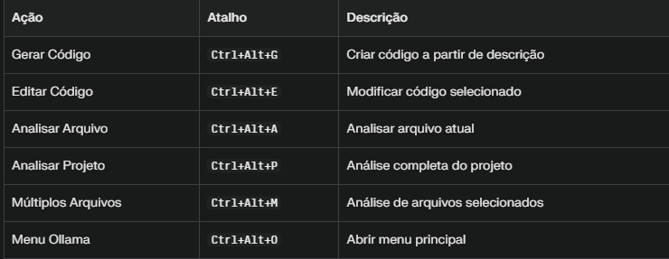
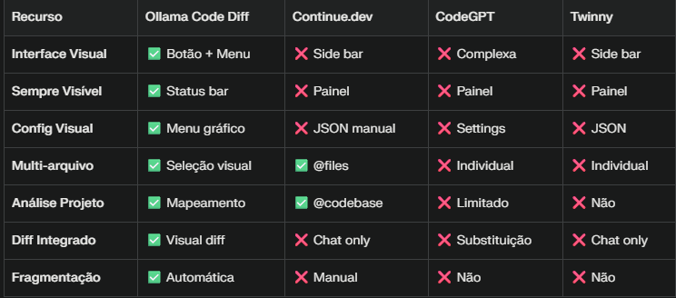

## 🤖 Ollama Code Diff v2.0

=====================

Uma extensão moderna do Visual Studio Code que integra modelos de IA locais via Ollama para torna-se seu **Par Programador Local**. Agora com **Ghost Text**, **Agente Autônomo** e **RAG**.

> 📘 **[Guia Completo de Uso (Walkthrough)](WALKTHROUGH.md)**: Leia o guia detalhado para aprender a usar todas as novas funções.

### ✨ Novas Funcionalidades (v2.0)

*   **👻 Ghost Text**: Autocompletar inteligente em tempo real (estilo Copilot) enquanto digita.
*   **🤖 Agente Autônomo**: Um modo de chat onde a IA pode executar ferramentas (criar arquivos, rodar comandos, ler código) para resolver tarefas complexas.
*   **🧠 RAG (Busca Semântica)**: Indexe seu projeto e faça perguntas conceituais ("Como funciona a auth?") que a IA responde lendo os arquivos certos.
*   **🔗 Contexto Inteligente**: Mencione arquivos com `@arquivo` ou fixe-os com **Pin (📌)** para dar contexto preciso à IA.
*   **⚡ Slash Commands**: Use `/explain`, `/fix`, `/test` para ações rápidas.

### ✨ Funcionalidades Principais (Clássicas)

------------------------------
### 🎯 Interface Visual Única
Botão na barra de status para acesso rápido
Menu contextual inteligente com opções baseadas no contexto atual
Configurações visuais sem necessidade de editar JSON
Seleção de modelos com ícones e informações detalhadas
### 🔧 Capacidades de Código
Gerar código a partir de descrições em linguagem natural
Editar código selecionado com instruções específicas
Visualizar diffs entre código original e modificado
Aplicar mudanças com confirmação visual
### 📊 Análise Avançada
Análise de arquivos individuais com prompts customizados
Análise de projetos completos com mapeamento de estrutura
Análise de múltiplos arquivos selecionados pelo usuário
Fragmentação automática para arquivos grandes (50KB+)
### ⚡ Otimizações
Suporte a modelos locais - privacidade total
Configuração dinâmica de contexto e tokens
Múltiplos modelos com troca instantânea
Performance otimizada para diferentes tamanhos de arquivo
### 🚀 Instalação
------------------
Pré-requisitos:
* Visual Studio Code 1.85.0 ou superior
* Ollama instalado e rodando localmente
* Node.js para desenvolvimento (se compilando do código)
### Windows
### Baixar de <https://ollama.ai/download>
### Modelos recomendados para código
ollama pull codellama:7b-instruct-q5_K_M
ollama pull qwen2.5-coder:7b
ollama pull qwen2.5-coder:1.5b-base
### Verificar instalação
ollama list
## 📱 Como Usar
### 🎯 Acesso via Botão (Método Principal)
Localize o botão 🤖 Ollama na barra de status (canto inferior direito)
Clique no botão para abrir o menu de opções
Selecione a ação desejada:
Gerar Código - Criar novo código
Editar Código - Modificar código selecionado
Analisar Arquivo - Revisar arquivo atual
Analisar Projeto - Análise completa do workspace
Múltiplos Arquivos - Comparar arquivos específicos
Configurações - Alterar modelo e parâmetros
⌨️ Atalhos de Teclado (Opcional)



### 🤖 Modo Agente (Interação Avançada)

No modo Agente, a extensão Ollama Code Diff se transforma em um assistente de IA capaz de executar ações diretamente no seu ambiente VS Code. Você pode instruí-lo a realizar tarefas complexas usando comandos específicos (ferramentas).

**Como Ativar:**
1.  No painel de chat da extensão, selecione "Agent" no seletor de modo.
2.  Envie suas instruções usando o formato de comando das ferramentas.

**Ferramentas Disponíveis no Modo Agente:**

*   **`/run <command>`**: Executa um comando no terminal com confirmação do usuário, captura `stdout/stderr/exit code` e anexa a saída ao contexto do Agent.
    *   Exemplo: `/run npm install`
*   **`/read <file_path>`**: Lê o conteúdo de um arquivo.
    *   Exemplo: `/read src/extension.ts`
*   **`/write <file_path> <content>`**: Escreve conteúdo em um arquivo. Se o arquivo não existir, ele será criado.
    *   Exemplo: `/write test.txt "Hello World"`
*   **`/generate_code <generation_prompt>`**: Gera código baseado em um prompt e o aplica **automaticamente** ao editor ativo.
    *   Exemplo: `/generate_code Crie uma função JavaScript para somar dois números.`
*   **`/edit_code <editing_instruction>`**: Edita o código selecionado no editor ativo e aplica as mudanças **automaticamente**.
    *   Exemplo: `/edit_code Refatore esta função para usar arrow functions.`
*   **`/analyze_file <file_path> <analysis_instruction>`**: Analisa um arquivo específico com base em uma instrução.
    *   Exemplo: `/analyze_file src/ollama.ts Encontre possíveis bugs de performance.`
*   **`/list_files <directory_path>`**: Lista arquivos e diretórios em um caminho específico.
    *   Exemplo: `/list_files src`
*   **`/execute_vscode_command <command_name> [...args]`**: Executa um comando interno do VS Code.
    *   Exemplo: `/execute_vscode_command editor.action.formatDocument`
*   **`/open_file <file_path>`**: Abre um arquivo no editor do VS Code.
    *   Exemplo: `/open_file src/extension.ts`
*   **`/apply_code_changes <new_code> [startLine] [startCharacter] [endLine] [endCharacter]`**: Aplica alterações de código diretamente no editor ativo. Esta ferramenta é usada internamente por `generate_code` e `edit_code`.
    *   Exemplo: `/apply_code_changes "console.log('Hello');" 0 0 0 0` (para inserir no início)
*   **`/apply_diff <diff_content>`**: Aplica um patch de diff a um arquivo. Útil para aplicar patches externos.
    *   Exemplo: `/apply_diff "diff --git a/file.txt b/file.txt
index 123..456 100644
--- a/file.txt
+++ b/file.txt
@@ -1 +1 @@
-old line
+new line"`
*   **`/find_file <file_name_or_pattern>`**: Localiza um arquivo no workspace.
    *   Exemplo: `/find_file "package.json"`
    *   Exemplo: `/find_file "*.ts"`
*   **`/save_file`**: Salva o arquivo ativo no editor.
*   **`/close_file`**: Fecha o arquivo ativo no editor.
*   **`/get_selected_text`**: Obtém o texto atualmente selecionado no editor ativo.

### 💡 Exemplos de Uso
--------------------
### 🔨 Gerar Código
```
# 1. Posicione o cursor onde quer o código
# 2. Botão Ollama → "Gerar Código"
# 3. Prompt: "Função para calcular fibonacci recursivo"
# 4. Revisar diff e aplicar
```
### ✏️ Editar Código
------------------
```javascript
// 1. Selecione o código
function oldFunction(data) {
    return data.filter(x => x > 0);
}
// 2. Botão Ollama → "Editar Código" 
// 3. Instrução: "Adicionar validação de tipos"
// 4. Ver diff com melhorias
```
### 🔍 Analisar Arquivo
-------------------
```
// 1. Abra arquivo para análise
// 2. Botão Ollama → "Analisar Arquivo"
// 3. Prompt: "Encontrar possíveis bugs"
// 4. Resultado em aba Markdown lateral
```
## ⚙️ Configurações
----------------
### 🎨 Via Interface (Recomendado)

Botão Ollama → Configurações → Modelo Ollama

Selecionar modelo da lista com ícones:

 🐭 Modelos pequenos (< 1GB) - Rápidos
 🐃 Modelos médios (1-5GB) - Balanceados
 🦏 Modelos grandes (5-10GB) - Alta qualidade
 🐘 Modelos muito grandes (10GB+) - Máxima qualidade
 📋 Via Settings do VS Code

```bash
# Abrir configurações
Ctrl+, → pesquisar "ollama-code-diff"
```

### 🔧 Configurações Disponíveis
------------------------------


### 📊 Configurações por Tipo de Uso'
-----------------------------------
### ⚡ Performance (Modelos Pequenos)
```json
{
  "ollama-code-diff.modelName": "qwen2.5-coder:1.5b-base",
  "ollama-code-diff.contextSize": 16384,
  "ollama-code-diff.maxTokens": 4096
}
```
### 🎯 Qualidade (Modelos Grandes)
```json
{
  "ollama-code-diff.modelName": "qwen2.5-coder:7b",
  "ollama-code-diff.contextSize": 32768,
  "ollama-code-diff.maxTokens": 8192
}
```
### 🏗️ Arquivos Grandes
```json
{
  "ollama-code-diff.contextSize": 65536,
  "ollama-code-diff.chunkSize": 50000,
  "ollama-code-diff.maxTokens": 16384
}
```



### 🔧 Troubleshooting
-------------------
### ❌ Botão não aparece na barra de status
```bash
# 1. Verificar se extensão está ativa
Ctrl+Shift+P → "Developer: Show Running Extensions"
# 2. Verificar barra de status
View → Appearance → Status Bar
# 3. Recompilar extensão
npm run compile
```
### ❌ Erro "Ollama não está respondendo"
```bash
# 1. Verificar se Ollama está rodando
ollama serve
# 2. Testar conexão
curl http://localhost:11434/api/tags
# 3. Verificar modelos
ollama list
```
### ❌ Atalhos não funcionam
```bash
# 1. Verificar conflitos
Ctrl+K Ctrl+S → pesquisar atalho
# 2. Usar settings.json
{
  "keyboard.dispatch": "keyCode"
}
# 3. Usar botão visual como alternativa
```
### ❌ Análise de arquivo muito lenta
```bash
# 1. Reduzir tamanho do contexto
"ollama-code-diff.contextSize": 16384
# 2. Usar modelo menor
"ollama-code-diff.modelName": "qwen2.5-coder:1.5b-base"
# 3. Reduzir chunk size
"ollama-code-diff.chunkSize": 15000
```
## 📈 Roadmap
----------
### 🔜 Próximas Funcionalidades

Histórico de interações

Templates de prompts customizáveis

Métricas de uso e performance

Suporte a mais linguagens de programação

Integração com Git para análise de commits

Exportação de análises em PDF/HTML

### 🤝 Contribuição
--------------
### 📝 Como Contribuir
Fork o repositório

Clone sua fork localmente
Crie branch para sua feature (git checkout -b feature/nova-funcionalidade)
Commit suas mudanças (git commit -am 'Adiciona nova funcionalidade')
Push para branch (git push origin feature/nova-funcionalidade)
Abra Pull Request
### 🐛 Reportar Bugs
Use as GitHub Issues para reportar bugs ou sugerir melhorias
### 💡 Sugestões
Ideias para novas funcionalidades são sempre bem-vindas! Abra uma issue com tag enhancement.
## 📄 Licença
Este projeto está licenciado sob a Licença MIT. Veja o arquivo [LICENSE](LICENSE) para mais detalhes.
## 👨‍💻 Desenvolvedor
Criado por **Adriano Severino** como parte do desenvolvimento de uma linguagem de programação educacional em português brasileiro.

MIT License

Copyright (c) 2023 Adriano Severino

Agradecimentos
Ollama - Pela excelente ferramenta de IA local
VS Code Team - Pela extensível API de extensões
Comunidade Open Source - Pelas inspirações e feedback
⭐ Se esta extensão foi útil, considere dar uma estrela no repositório! ⭐
